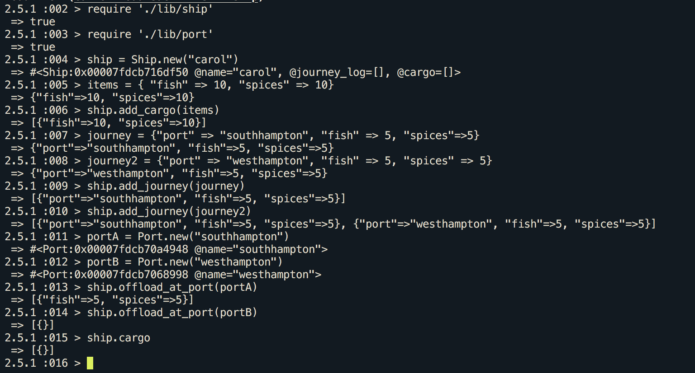
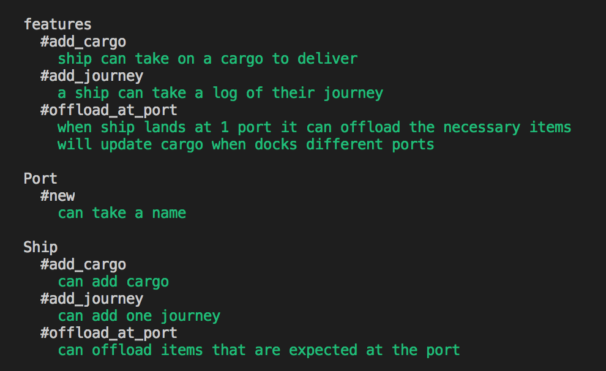

# Cargo Delivery Application

A application in Ruby that will offload a ships cargo as it travels from port to port

# QuickStart
* `git clone https://github.com/CazaBelle/cargo-delivery-system-ruby.git`
* `cd cargo-delivery-system-ruby`
* `rspec` #runs tests
* `irb` #use program see demo below

# Class Diagram


# User Stories 
```
As a ship captain 
So I have items to deliver 
I want to take on a cargo 

As a ship captain 
So I know what I'm to deliver 
I want to have a journey log with the items to deliver 

As a ship captain 
So I deliver the right items 
I want to be able to see what each port needs to be dropped off 

As a ship captain 
So I decrease my inventory 
I want to be able to offload my cargo
```
# Demo


# Testing 
* Feature tests heavily guided the developement of this program 
* Unit testing done to ensure all methods acting as anticipated



